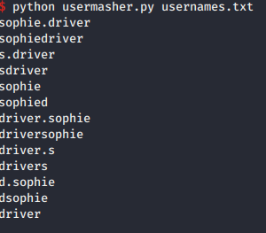
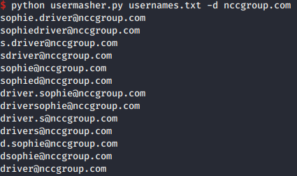

UserMasher

Take a list of names (first name and surname) and give a list of different combinations (or a selected one if a username format is known). Could be useful for a list harvested from public sources such as LinkedIn)

There's similar tools that exist elsewhere, but this was a "My First Python Project" to get started with. 

Example output with a name "Sophie Driver"

Example output with a domain (for an email format)

